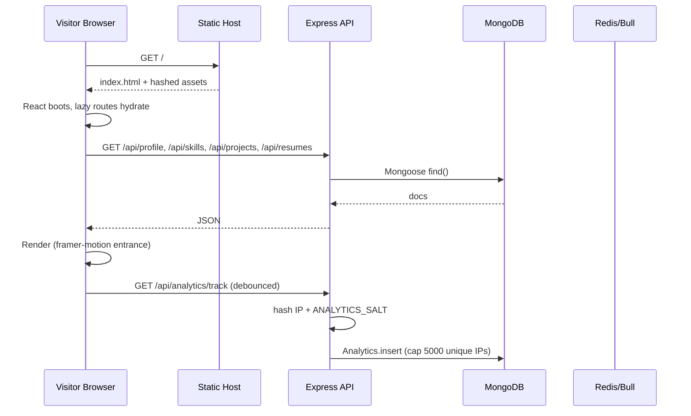

# Portfolio — Interview Prep

**Audience:** Mohammad Khalid (the author). Use this when asked to explain the project in any technical interview.
**Companion docs:** `README.md`, `CHANGES.md`, `GAP_ANALYSIS.md`, `important_resource/features.md`.
**Last updated:** September 7, 2026.

---

## 1. Elevator Pitch (60 seconds)

> I built a personal portfolio that doubles as a live product. It has the obvious pieces — a classic and a Bento layout, dark mode, blog with Mermaid diagrams, postmortems, live chat, ATS resume scorer, AI chat over my resume context — but the interesting parts are the operational ones:
>
> 1. A **multi-adapter job auto-apply pipeline** (Indeed, Naukri, Wellfound, Foundit, LinkedIn, generic) that fetches jobs, dedupes them, scores against my profile, generates a tailored PDF resume with an LLM, fills site-specific forms via Puppeteer, submits, and only marks "applied" after the site confirms.
> 2. A **queue + worker** (Bull on Redis, with an in-memory fallback) that runs the pipeline asynchronously so the UI never blocks, retries browser disconnects safely, and persists progress so a refresh or crash can resume.
> 3. A **LinkedIn + X social publisher** with OAuth 2.0 (PKCE for X), HMAC-signed OAuth state, AES-256-GCM token storage, AI-generated post copy and images, and an X teaser that links to the LinkedIn URL.
> 4. **Hardened auth**: 12h access JWT + 30-day httpOnly refresh cookie, silent refresh with rotation, `tokenVersion` for instant invalidation, CSRF double-submit, helmet + CSP, mongo-sanitize + hpp + sanitize-html, file magic-byte sniffing, rate limits, generic error messages.
>
> The frontend is React 19 + Vite + Tailwind 4 with lazy routes; the backend is Express 5 + Mongoose 9 + Socket.io. There are 28 Jest tests on the server today; the client has no tests yet — that's my next phase.

---

## 2. Architecture at a Glance

### 2.1 Request Lifecycle — Visitor Loads Homepage



### 2.2 Auto-Apply Pipeline

```mermaid
flowchart LR
  A[Cron: FETCH] -->|Job[]| B[Dedupe + Match]
  B -->|matched Jobs| C[Enqueue Apply]
  C --> D[worker.js<br/>FETCH → MATCH → GENERATE_RESUME<br/>DETECT_FIELDS → SUBMIT]
  D -->|LLM call| E[OpenAI / Groq]
  D -->|PDF| F[pdf-lib]
  D -->|Browser| G[Puppeteer<br/>+ per-site adapter]
  G -->|submit| H[Indeed / Naukri /<br/>Wellfound / Foundit /<br/>LinkedIn / Generic]
  H -->|confirmation| I[confirmApplied]
  I -->|applied| J[Application.status='applied'<br/>+ Socket emit]
  I -->|uncertain| K[not_applied + manual queue]
  I -->|failed| L[catch → emit progress<br/>+ push notification]
```

### 2.3 Component Map (high level)

- **Client** (`client/src/`): `App.jsx` (router + lazy + ProtectedRoute), `pages/` (15 pages), `components/` (Navbar, Hero, Timeline, Skills, Projects, Certifications, Contact, CookieConsent, ChatWidget, MermaidDiagram, SEO, ScrollToTop, plus `bento/` and `ats/` subfolders), `features/admin/` (EditModal, ProfileForm, 17-tab dashboard), `features/social/` (ComposeForm, GenerateProgress, HistoryList, PostPreview, SocialTab), `context/` (Auth, Theme), `lib/api.js` (axios + JWT + CSRF + silent refresh).
- **Server** (`server/`): `server.js` (route mount), 20 Mongoose models, 24 route files, controllers (`base` + `shared` CRUD factory + 5 per-resource), services (resume AI, ATS, social OAuth, browser, session refresh, notifications), adapters (one per site + generic), `queue/` (index, worker, scheduler, socialJobs), `socket/index.js` (live chat + admin room), middleware stack (auth, csrf, security, rate limit, sanitize, validate, errorHandler).

---

## 3. Tech Stack — "Why this, not that"

| Layer | Choice | Why |
|---|---|---|
| **Client framework** | React 19.2 + Vite 8 | Vite is faster to start, instant HMR, and produces a smaller cold-cache SPA than CRA. React 19 gives us concurrent features and stable `useActionState` patterns I plan to use. |
| **Routing** | react-router-dom 7 with lazy routes | Code-split per page; the visitor never downloads `/admin/*` unless they authenticate. |
| **Styling** | Tailwind 4 (CSS-first config) + framer-motion 12 | Tailwind for layout / utility speed; framer-motion only where transitions add real value (page enter, modal, carousel). No UI kit — full control, smaller bundle. |
| **Markdown / diagrams** | react-markdown 10 + mermaid 11 | Mermaid renders inside Markdown for blog and postmortem diagrams without a server round-trip. |
| **HTTP** | axios 1.16 with interceptors | One place to attach JWT, handle 401 → silent refresh, attach CSRF, retry idempotent requests. |
| **Realtime** | socket.io-client 4.8 | Auto-reconnect, rooms, fallbacks; trivial admin room auth via `tokenVersion`. |
| **Backend** | Node + Express 5 (CommonJS) | Smallest viable API surface; middleware ecosystem is mature; `helmet` + `cors` + `express-rate-limit` cover 90% of hardening out of the box. CommonJS keeps the worker simple to spawn. |
| **ODM** | Mongoose 9 | Schema + hooks + lean queries + transactions; lets me prototype fast. For this single-tenant app the lack of joins is rarely painful. |
| **Queue** | Bull 4 on Redis, in-memory fallback | Bull gives me retries, backoff, dead-letter, and progress events out of the box. The in-memory fallback lets me dev without Redis but is loudly refused by the standalone worker to prevent split-brain. |
| **Realtime server** | socket.io 4.8 | Same reason as client; room-based admin auth with `tokenVersion` is two lines. |
| **LLM** | OpenAI SDK 6 (OpenAI-compatible) | Same client points at OpenAI or Groq via `baseURL`; lets me switch for cost / latency without rewriting call sites. |
| **Browser automation** | Puppeteer 25 | Older API than Playwright but every adapter is already on it; works fine for headless + interactive (login-via-browser) flows. |
| **PDF** | pdf-lib 1.17 + pdf-parse 2.4 | pdf-lib to **generate** tailored resumes; pdf-parse to **read** uploaded resumes for ATS scoring. |
| **Email** | nodemailer 9 | Standard SMTP; ready for Phase 4 (digest emails). |
| **Security** | helmet 8 + cors + hpp + express-mongo-sanitize + sanitize-html + validator | Layered defense; sanitize-html for blog content; validator for input shape. |
| **Auth** | jsonwebtoken 9 + bcryptjs 3 | 12h access JWT, 30-day refresh, `tokenVersion` for kill-switch. |
| **Tests** | jest 30 + supertest 7 (server only) | Server has 28 tests today; Vitest + RTL for the client is Phase 5. |

---

## 4. Q&A

### A. Architecture

#### A1. Walk me through the request lifecycle of a visitor opening the homepage.
1. Browser hits `/`, the static host returns `index.html` plus hashed JS/CSS.
3. React boots; the router lazy-loads each route on demand — `/admin/*` is not downloaded for anonymous visitors.
4. `Home.jsx` mounts and fires parallel `GET`s for `/api/profile`, `/api/skills`, `/api/projects`, `/api/certifications`, `/api/resumes`. There is no auth on these — they're public data.
5. The client renders, fires framer-motion entrance animations, then POSTs a debounced analytics ping to `/api/analytics/track`. The server hashes the IP with `ANALYTICS_SALT` and inserts into `Analytics`, capped at 5000 unique IPs (`server/routes/analytics.js:6,31`).
6. Socket.io is **not** connected on the homepage — only the chat widget and admin dashboard open a socket. That keeps the homepage cheap.

#### A2. How does the auto-apply pipeline work end-to-end?
A cron job (`server/queue/scheduler.js`) triggers `FETCH` periodically. Each enabled site adapter returns jobs; `services/jobDedupe.js` drops duplicates across sites by URL hash. Matched jobs get an `Application` document with status `pending` and are enqueued. The worker (`server/queue/worker.js`) processes each application through five steps: **FETCH → MATCH → GENERATE_RESUME → DETECT_FIELDS → SUBMIT**. Each step is wrapped in a try/catch that persists progress on the `Application.progress.steps` array and emits a Socket.io progress event so the admin dashboard updates without a manual refresh. On failure, the worker `break`s the chain (no later step runs) and routes to manual apply if the error pattern indicates an external employer handoff (`isManualApplyFailure`).

#### A3. Why split client and server into separate packages?
Three reasons: (1) deployment — the client is a static SPA that can be hosted on any CDN; the server is a Node process that needs Redis + Mongo. (2) toolchain — the client uses Vite + ESLint flat config; the server uses Jest + CommonJS. Mixing them forces compromises. (3) dependency isolation — Puppeteer alone adds ~300MB; keeping it server-only means the client bundle never bloats. Trade-off: two `package.json`s to maintain, and cross-cutting changes (auth contract, API shape) need to land in both.

#### A4. How would you scale this for 10k concurrent users?
Most of the homepage is static and CDN-friendly — I'd put Cloudflare in front and bump cache headers. The Express API is stateless and would scale horizontally behind a load balancer; sticky sessions aren't needed because JWT carries all identity. The hard part is the worker: Puppeteer is single-threaded and memory-heavy. I'd (a) cap site concurrency in `UserSettings`, (b) run one worker process per CPU core on a dedicated pool, (c) move the adapters to a queue-per-site with priority. Analytics would move from `Analytics` collection to a time-series store (ClickHouse or Timescale). The Socket.io layer would migrate to the Redis adapter so multiple Node instances share rooms.

#### A5. How do you handle long-running operations?
Two paths. **Synchronous path:** anything that must finish before the user sees a result (login, save item, file upload) is a normal request/response. **Asynchronous path:** the auto-apply pipeline and the social publisher publish jobs are queued. The HTTP endpoint enqueues and returns `{ jobId }` in <100ms. The worker emits Socket.io progress and writes a row to the model so the UI can refresh on demand. This keeps request latency bounded and lets the worker back off, retry, and crash-safely.

#### A6. Caching — where would you add it?
Today there is **no** application-level cache layer; the homepage profile/skills/projects are served straight from Mongo on every request. Where I'd add it: (1) `GET /api/profile` and `/api/skills` get a 60s in-memory LRU with stale-while-revalidate, since they change rarely. (2) The blog list and individual postmortems get a Redis cache invalidated on admin write. (3) The job listing pages cache matched-job lists for 5 min. I'd **not** cache the auto-apply worker results — they're already cached in Mongo and freshness matters.

---

### B. Stack & Decisions

#### B1. Why Vite over CRA / Next.js?
Vite gives me native ESM in dev (instant HMR) and Rollup in production. CRA is unmaintained. Next.js would have given me SSR, but this is a portfolio where the data is small and dynamic enough that client-side fetching + `react-helmet-async` for SEO is simpler. I considered Astro, but I needed a fully interactive admin dashboard and not just content pages, so React made more sense.

#### B2. Why Express over Fastify / Nest?
Express 5 is finally async-native (no `express-async-errors` shim needed). The middleware ecosystem (`helmet`, `cors`, `express-rate-limit`, `multer`, `hpp`, `express-mongo-sanitize`) is unmatched. Fastify is faster, but I don't need the throughput and would lose easy `req.body` / `req.cookies` patterns. Nest's DI / module system is overkill for a single-tenant app of this size.

#### B3. Why MongoDB over Postgres?
Document shape: skills have nested items, projects have arrays of bullets, postmortems have nested timeline events and action items. Mongoose's schema + lean + populate covers it cleanly. The single-tenant write rate is low; I never touch the document-document relations Postgres excels at. **The honest answer:** I could absolutely rewrite this on Postgres + Prisma; it would gain me joins and migrations and lose me schema flexibility. For a portfolio, Mongo wins on iteration speed.

#### B4. Why Bull + Redis vs an in-house queue?
Bull gives me retries with exponential backoff, concurrency limits, stalled-job detection, and event emitters for `completed` / `failed` / `progress`. The alternative (an `EventEmitter` + setInterval drain loop) is two days of work I'd spend re-discovering edge cases Bull already handles. Redis itself is one container to run.

#### B5. Why Socket.io vs raw WebSocket / SSE?
Socket.io gives me rooms, automatic reconnection with backoff, and the same API on the client and server. SSE is great for one-way push but I'd lose admin-room targeting. Raw WebSocket would force me to implement subprotocols and reconnect logic.

#### B6. Why framer-motion + Tailwind instead of a UI kit?
A UI kit (MUI, Chakra, Mantine) would have shipped faster but added 50–150KB and constrained design. Tailwind keeps the bundle small; framer-motion is imported only where transitions add value (modals, page enter, carousel). The trade-off is more bespoke CSS work; for a portfolio that needs to look distinct, that's the right call.

#### B7. Why Puppeteer over Playwright?
The adapters were written first, and Puppeteer's `page.$$('input[type="file"]')` + `uploadFile` flow worked on the first try for resume uploads. Playwright has nicer auto-waiting and multi-browser, but every adapter is already on Puppeteer's API. Rewriting would be pure churn for no user benefit. I would pick Playwright for a new project today.

#### B8. OpenAI vs Groq — why the abstraction?
Cost vs latency. Groq is faster and cheaper for short prompts; OpenAI is the only option for some models. The `ai/client.js` wrapper picks the provider based on `LLM_PROVIDER` and the call sites don't care. If OpenAI raises prices or Groq adds a model I want, I flip an env var.

---

### C. Frontend

#### C1. How is auth state shared across the SPA?
`AuthContext` (`client/src/context/AuthContext.jsx`) wraps the router and exposes `{ user, login, logout, refresh }`. `ProtectedRoute` reads it. On mount, it calls `/api/auth/me` to rehydrate the user from the httpOnly refresh cookie. The access JWT lives in memory (not localStorage) to avoid XSS exfiltration; the refresh cookie is httpOnly + Secure + SameSite=Lax, so JS can't read it.

#### C2. How do you avoid a forced logout every 12 hours?
Silent refresh. The axios interceptor (`client/src/lib/api.js`) catches 401, calls `POST /api/auth/refresh` (which reads the httpOnly cookie), gets a new access JWT, retries the original request. The refresh token rotates every use and is invalidated by `tokenVersion` on the user document, so a stolen refresh cookie becomes useless after the next login. Net effect: a user stays logged in for 30 days without ever re-entering a password.

#### C3. CSRF strategy on a JWT auth API?
The access JWT is sent as `Authorization: Bearer` (not in a cookie), so it's not auto-attached by the browser and is therefore not vulnerable to classic CSRF. The **refresh** cookie *is* httpOnly + SameSite=Lax, which blocks cross-origin form posts. For state-changing requests that go through the cookie path (the refresh endpoint itself), the server uses a CSRF double-submit: a non-httpOnly cookie holds a token, and the request body / header must echo it. `server/middleware/csrf.js` validates.

#### C4. How is the AdminDashboard tab state managed?
The 17-tab dashboard (`client/src/pages/AdminDashboard.jsx`) is one component with local `useState` for the active tab key. I considered React Router nested routes but it would have ballooned the file count for the same UX. Trade-off: the file is 3,400 lines (Phase 3 of `GAP_ANALYSIS.md` splits it per tab).

#### C5. Why lazy routes and how do they behave on slow networks?
`React.lazy` + `Suspense` defers each route's JS chunk until the user navigates to it. The homepage never downloads `/admin/dashboard` or `/ats-checker`. On a slow 3G connection, the lazy chunk shows a fallback spinner; once it loads, it's cached. Worst case: a tab takes 1–2s on first paint after navigation; subsequent visits are instant.

#### C6. Dark mode without a flash of wrong theme?
The theme preference is in `localStorage`; on first paint, an inline `<script>` reads it and sets `data-theme` on `<html>` before React boots. `ThemeContext` then hydrates from the same value. If the user has never picked, the script falls back to `prefers-color-scheme`. No flash because the script runs before CSS is applied.

#### C7. SEO on a SPA — what do you do and what's the limit?
`react-helmet-async` sets `<title>`, `<meta>`, OG tags, and JSON-LD per page. There's also a `robots.txt` and a sitemap generator. The **limit**: search engines see the empty `<div id="root">` and must wait for JS to render. For a portfolio that ranks on the author's name + niche skills, this is fine. For a content-heavy site I'd pre-render at build time with `vite-plugin-ssr` or move to Next.js.

#### C8. Accessibility quick wins / known gaps.
Wins: semantic landmarks (`<header>`, `<main>`, `<nav>`, `<footer>`), focus rings preserved, `aria-label` on icon-only buttons, keyboard-navigable carousels. Gaps: the Bento layout has some draggable cards that don't have keyboard equivalents; the chat widget's "Send on Enter" doesn't announce the message; color contrast on `text-blue-500` on white was borderline (this was the bug I just fixed — `text-red-500` for errors is a separate but adjacent concern).

---

### D. Backend

#### D1. How do you authenticate an admin? Walk me through login → token.
`POST /api/auth/login` (`server/routes/auth.js`) takes `{ username, password }`, looks up the `Admin` document by username, runs `bcrypt.compare`. On success, it issues a **12h access JWT** signed with `JWT_SECRET` containing `{ userId, username, tokenVersion }`, sets a **30-day httpOnly refresh cookie** containing a separate signed JWT, and returns `{ accessToken, user }`. The client stores the access token in memory (not localStorage). On every API call the axios interceptor attaches it as `Authorization: Bearer`. On 401, the interceptor calls `POST /api/auth/refresh`, the server validates the refresh cookie (and `tokenVersion`), issues a new access JWT + rotates the refresh cookie, and the original request is retried.

#### D2. Why both access and refresh tokens, and how does `tokenVersion` invalidation work?
Short-lived access tokens limit the blast radius of an XSS leak. Long-lived refresh tokens in an httpOnly cookie give the user 30 days of "stay logged in" without re-prompting. `tokenVersion` is an integer on the admin document; the JWT payload includes it. On password change or admin-disable, I increment `tokenVersion` and every outstanding access token (whose `tokenVersion` is now stale) is rejected on next refresh. This is the kill-switch.

#### D3. Rate limiting — which routes, which limits, why?
- **Login:** 5 attempts / 15 min / IP (`server/middleware/rateLimiter.js`). Stops credential stuffing.
- **ATS check:** 5 uploads / 15 min / IP. Stops PDF-parsing CPU abuse.
- **Analytics track:** 30 / min / IP. Stops analytics spam.
- **Global API:** 200 / min / IP. Backstop.
The bucket is in-memory per process; for horizontal scaling I'd move to `rate-limit-redis` so all replicas share the counter.

#### D4. File upload security — what do you check?
Resume PDF (`server/routes/ats.js`, `server/routes/upload.js`): (1) multer memory storage with a 10MB cap. (2) magic-byte sniffing via `server/utils/fileType.js` — the first 4 bytes must be `%PDF`. (3) `pdf-parse` runs in a try/catch and rejects files it can't parse. (4) Filenames are sanitized. (5) The parsed text is also length-capped before it reaches the LLM, so a malicious PDF can't blow up token cost. Generic image uploads get the same magic-byte check (`jpeg`, `png`, `webp` only).

#### D5. Input validation strategy?
Hand-rolled per route using `validator` + small helper functions in `middleware/validate.js`. No Joi / Zod today because the surface is small and I want explicit error messages. I'd reach for Zod when the team grows past one contributor or the schema starts to be reused client-side (Zod dual-infers types).

#### D6. How do you sanitize user-controlled HTML/Markdown?
Blog content is Markdown (no raw HTML allowed by the editor). Anything that gets rendered with `dangerouslySetInnerHTML` is passed through `sanitize-html` (`server/routes/articles.js`) with an allowlist of tags. AI-generated post copy for social publishing is similarly sanitized before being displayed in the admin dashboard preview.

#### D7. Error handling pattern — what does the user see vs what gets logged?
`middleware/errorHandler.js` is the last-resort handler. Every thrown error from a controller bubbles here. The user sees a generic `{ error: 'Something went wrong' }` — never the stack or the SQL. The server logs `err.message`, `err.stack`, `requestId`, `userId`, and route. 503 is mapped from infra failures (Mongo down, Redis down) so the client can retry. Validation errors from `validate.js` return 400 with a structured `{ error, fields }` so the form can highlight inputs.

#### D8. How are Mongoose models versioned/extended safely?
Each model file exports a `Schema` and the compiled model. Models that need to add fields later use a `schema.add({...})` call guarded by a `if (process.env.NODE_ENV !== 'production')` block during the transition, or a one-off migration script. I lean on Mongoose's `strict: true` default so unknown fields are dropped on save. There's no formal migration tool today (Phase 3 introduces `migrate-mongo`).

---

### E. Job Automation

#### E1. How do you avoid applying to the same job twice?
Two layers. (1) `services/jobDedupe.js` hashes each job URL and skips jobs whose hash already exists in `Job` for the same user. (2) At the `Application` level, the unique index on `(userId, jobId)` makes duplicate enqueue a no-op. Cross-site dedupe is by URL prefix normalization (LinkedIn vs Indeed link to the same Lever job are collapsed).

#### E2. How do you keep the user's session cookies fresh across days?
`services/sessionRefresh.js` runs on a schedule. After a successful login or submit, it calls `captureCookiesFromContext` to persist the live cookie jar (encrypted with `AES-256-GCM`) onto the `UserJobSite.cookies` field. Before each apply it calls `refreshSiteCookies` which, if the cookie is older than 24h, opens a headless browser, sets the cookie, hits the site, and re-persists whatever the site rotated to. If the cookie is expired, the user is prompted to re-login.

#### E3. How do you avoid getting the user banned?
Per-site concurrency caps in `UserSettings.siteConcurrency` (default 1) and `applyRateDelayMs` (default 15s) — so we never hit a site with two parallel browsers. The worker `acquireSiteSlot` enforces this. Adapters use `gotoWithBackoff` and explicit `delay()` calls to look human. I don't run automation at night or on weekends. **Honest caveat:** scraping LinkedIn / Indeed / Naukri violates their ToS; operational users accept the risk.

#### E4. What happens if the AI budget runs out mid-pipeline?
Today, the pipeline aborts with `not_applied: 'site_error'`. The fix (Phase 2 of `GAP_ANALYSIS.md`) is to **degrade gracefully**: if the `generate_resume` step fails on AI budget, fall back to the user's most recent generated resume for that site. If `detect_fields` fails on AI, fall back to known-fields for the site. This means the apply still completes; only the personalization is weaker.

#### E5. How do you recover from a worker crash mid-application?
`rescueStuckApplications()` runs every 5 minutes (`worker.js:811`). Any application whose `status='pending'` and whose last progress event is older than 10 minutes gets re-enqueued. The pipeline is **idempotent per step**: `generate_resume` checks for an existing `GeneratedResume` for `(userId, jobId)` before calling the LLM again; `detect_fields` stores results on the application document; `submit` checks the site's apply state via `verifySubmitState` before retrying — so a duplicate submission is avoided.

#### E6. How do you test browser automation without flakiness?
Two approaches. **Pure unit tests** on the helpers (`confirmApplied`, `readApplyState`, `cookiesToHeader`, `cryptoSocial.encrypt/decrypt`) — these are deterministic and fast. **Integration tests** on adapters run against a recorded HTML fixture served by `http.createServer` in the test, with a Puppeteer page pointed at it. I avoid running against the real sites in CI — they change weekly and flake. Phase 5 of the plan adds both.

---

### F. Security & Privacy

#### F1. Threat model — biggest risks?
Ranked: (1) **Compromised admin credentials** → full DB read/write + queue control. Mitigations: bcrypt, rate limit, lockout, `tokenVersion` kill-switch, IP allowlist (planned). (2) **Server-side request forgery via adapter config** → a malicious job URL could SSRF internal services. Mitigations: adapters only navigate to the job URL the user explicitly approved; the URL is matched against an allowlist of site domains. (3) **Cookie / credentials leak** → AES-256-GCM at rest, `.gitignore` covers `server/data/`, screenshots purged. (4) **XSS in blog content** → `sanitize-html` allowlist. (5) **Mongo injection** → `express-mongo-sanitize` + `hpp`.

#### F2. Secrets management — what's in env vs vault vs DB?
- `.env` (gitignored): JWT secrets, Mongo URI, Redis URL, SMTP creds, OpenAI key, `ANALYTICS_SALT`, OAuth client IDs/secrets.
- DB (encrypted): `UserJobSite.credentials` (AES-256-GCM), `UserJobSite.cookies`, `SocialConnection.accessToken`.
- Never logged or returned in API responses.
- Phase 4 strengthens env-var placeholder detection so `JWT_SECRET=changeme` fails fast in production.

#### F3. How do you handle PII (resumes, login cookies)?
Resumes uploaded for ATS scoring are parsed in memory and never persisted unless the user explicitly saves. Login cookies for job sites are encrypted with `utils/cryptoSocial.js` (AES-256-GCM, random IV per record, key from `COOKIE_ENC_KEY`). Social OAuth tokens get the same treatment. Database backups would inherit the encryption key — for a stricter posture I'd add envelope encryption with a KMS-managed key.

#### F4. What's in your `.gitignore` and what's missing?
`.env`, `node_modules/`, `dist/`, `server/data/login-debug/` (Phase 4), `*.log`, `coverage/`, `.DS_Store`. Missing today: `.env.local`, `.env.*.local` (covered by `*.local` if added), `.vscode/` (personal IDE settings). `server/data/login-debug/` was committed and is being cleaned up in Phase 4.

---

### G. Trade-offs & "What would you change?"

#### G1. What would you rebuild first if you started over?
Probably the auto-apply pipeline. The current per-site adapter pattern works but the orchestration around it (`runStep`, `markStep`, `emitProgress`) is hard to follow. I'd model it as a state machine — a small library that takes `{ initial, transitions, sideEffects }` and produces a typed status. Each adapter becomes a list of transitions; the worker becomes the runtime. Trade-off: more upfront work for cleaner reasoning later.

#### G2. What's the tech debt you regret most?
The 3,400-line `AdminDashboard.jsx`. It's a single file because routing 17 tabs felt like overkill, but a year from now nobody wants to touch it. Phase 3 of `GAP_ANALYSIS.md` splits it per tab under `features/admin/tabs/*`. Second: the `_checkUnique` dead code in `crudService.js` — it's been dead for two refactors; I should have deleted it the first time.

#### G3. Multi-user support — how would you add it without breaking the single-user pipeline?
Today everything reads `userId` from the JWT but most queries don't filter by it — `UserJobSite`, `SocialConnection`, `Application` already have `userId` columns. I'd (1) introduce `req.user` middleware that sets `userId` from the JWT on every authenticated request. (2) Audit every route to ensure `find({ userId: req.user.id })`. (3) Move admin-vs-user auth into a single `requireAuth({ role })` middleware so the same routes serve both with permission gating. (4) Add an invite flow + tenant model in `Profile` or a new `Tenant` collection.

#### G4. CI/CD — what would you add on day 1 of a team?
GitHub Actions: (1) `client-lint` and `server-lint` on every PR. (2) `server-test` running Jest with a Mongo service container. (3) `client-build` to catch type errors. (4) `e2e` Playwright smoke against a staging deploy (homepage loads, login works, ATS upload returns a score). Deploy: Vercel for the client (atomic, CDN), a small VM or Fly.io app for the server with a managed Mongo and Redis.

---

### H. Behavioral

#### H1. Hardest technical problem on this project — how did you solve it?
**The browser-disconnect retry problem in the auto-apply pipeline.** Puppeteer occasionally disconnects mid-submit (Chromium crashes, the host kills the process for memory). Naively retrying posts a duplicate application — exactly what an apply tool must not do. Solution: before any retry, call `verifySubmitState`, which re-opens the job page logged-in and reads the apply button state. If the button says "Applied" or is disabled → return `{ applied: true, recoveredAfterCrash: true }`. If the button is still "Apply" → retry the submit. If we can't tell → fail loudly with `applied: false, uncertain: true` so the worker never marks it applied on uncertain evidence. The pattern is captured in `server/adapters/browser.js` (`withBrowserRetry` + `confirmApplied`) and tested with deterministic HTML fixtures.

#### H2. A trade-off you reversed midway — why?
**The `confirmApplied` default.** My first version returned `applied: true` when the page state was unreadable (e.g., the site handed off to an external employer with a 200 OK but no DOM I recognized). I told myself "the adapter didn't throw, so it probably worked." Then a user reported a phantom "Applied" they couldn't find in their email — the site had silently rejected the application. I reversed the default to `applied: false, uncertain: true` and added an explicit `verifySubmitState` gate. A false "not applied" gets verified and retried; a false "applied" is permanent damage. Asymmetric error cost → conservative default. This is the kind of bug `GAP_ANALYSIS.md` P0 #4 originally claimed was still open; verification showed it was already fixed.

#### H3. A bug I'm proud of having caught early.
The article published/Draft toggle in `EditModal.jsx`. The original code was `setForm({ ...form, published: form.published === false })` — looks like a toggle, is actually a constant assignment. Caught it because I clicked the toggle while authoring an article and the visual state never changed. The fix (`published: form.published === false ? true : false`) is the same line with an explicit ternary. I added it to my mental checklist: any time you see `=== false` inside a `setX`, double-check it's not in a callback where assignment was intended.

---

## 5. Cheat Sheet (last-page TL;DR)

### 30-second summary
> Portfolio + ATS scorer + AI chat + blog + live admin chat + multi-adapter auto-apply pipeline (Bull queue, Puppeteer, LLM-generated resumes, per-site adapters with safe retries) + LinkedIn/X social publisher. React 19 + Vite + Tailwind 4 on the front, Express 5 + Mongoose 9 + Socket.io on the back. 28 server tests today; Phase 5 adds client tests + CI.

### 5 most likely follow-ups

1. **"How does the auto-apply avoid duplicates?"**
   URL-hash dedupe in `Job`, unique index on `Application(userId, jobId)`, and `verifySubmitState` before any retry. Asymmetric error cost → conservative default (`applied: false, uncertain: true`).
2. **"How is auth hardened?"**
   12h access JWT (memory) + 30d refresh cookie (httpOnly, SameSite=Lax), CSRF double-submit on cookie routes, `tokenVersion` for kill-switch, helmet + CSP + mongo-sanitize + hpp + sanitize-html, file magic-byte sniffing, per-route rate limits, generic error messages.
3. **"Why MongoDB?"**
   Document shape fits nested data (skills, postmortems). Single-tenant write rate is low; joins are rare. Trade-off: I'd pick Postgres + Prisma for a multi-tenant SaaS.
4. **"Why a queue for apply?"**
   Browser automation is slow (10–60s per application). Async + persistent progress = UI never blocks, refresh recovers state, crashes don't lose work. Bull gives me retries, backoff, stalled-job detection for free.
5. **"What's the biggest tech debt?"**
   The 3,400-line `AdminDashboard.jsx`. Phase 3 of `GAP_ANALYSIS.md` splits it per tab.

### One-liner strengths
- Production-grade auth with silent refresh and kill-switch.
- Async pipeline with safe retry semantics on browser disconnects.
- Per-site adapters with conservative confirmation defaults.
- Defense-in-depth middleware stack.

### One-liner weaknesses (be honest)
- Zero client tests (Phase 5).
- Single-tenant by design; multi-tenant would be a rewrite of route filters.
- Scraping violates site ToS — operator accepts the risk.

---

## 6. Cross-references

- `README.md` — what the project is, how to run it.
- `CHANGES.md` — chronological changelog.
- `GAP_ANALYSIS.md` — known issues + 5-phase plan.
- `important_resource/features.md` — feature inventory.
- `SECURITY.md` — security policy.
- `client/src/` — frontend source.
- `server/` — backend source.

---

*Generated by the project author as interview prep material. Re-run / refresh after each phase ships.*